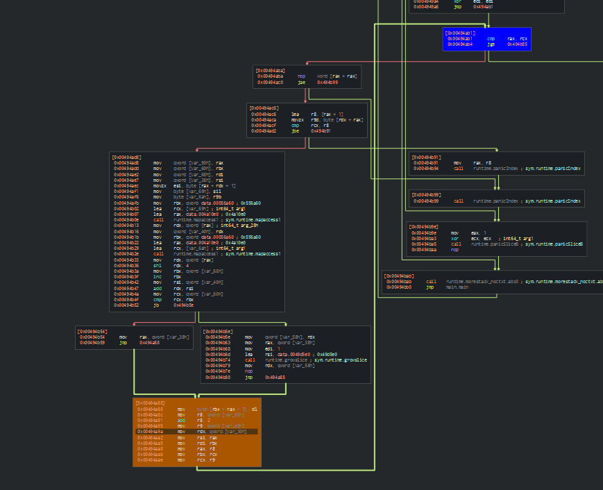

# Loops

An example of for loop.

In source code:

```go
for pos := 0; pos < len(hexString); pos += 2 {
	higherDigit := hexString[pos]
	lowerDigit := hexString[pos+1]

	value := hexValues[lowerDigit] + hexValues[higherDigit]*0x10

	data = append(data, byte(value))
}
```

In disassembly graph:

<figure><figcaption></figcaption></figure>

The loop check condition:

<figure><figcaption></figcaption></figure>

The loop increment:

<figure><figcaption></figcaption></figure>
