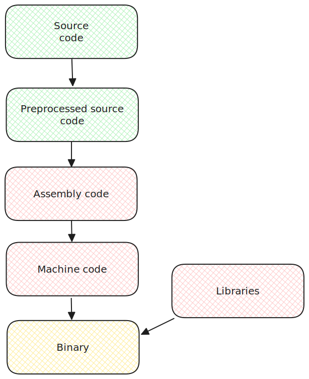

# 0x02 - Binary abyss

Have you ever wondered, is it possible to rebuild your source code from compiled binary? How to know all game secrets and hidden mechanics? How to analyze malware and viruses and know what are they doing?

Reverse Engineering is the way.

## Compilation

Let's break down the binary compilation process step by step:

<figure><figcaption></figcaption></figure>

**Preprocessing**

The first step involves preprocessing the source code. This phase handles preprocessor directives, such as `#include` statements and macro expansions. The output is an intermediate code.

For example, from two files:

```c
// Example: header file (header.h)
#ifndef HEADER_H
#define HEADER_H

void myFunction() {}

#endif
```

```c
// Example: source file (main.c)
#include "header.h"

int main() {
    myFunction();
    return 0;
}
```

Preprocessor will output:

```c
void myFunction() {}

int main() {
    myFunction();
    return 0;
}
```

You can view code after preprocesing, by using `-E` flag to GCC:

```bash
gcc -E main.c
```

**Compilation**

In this phase, the preprocessed code is translated into assembly code. The output is a set of object files, typically in machine-specific assembly language.

For example, the preprocessed code from above will be translated into:

```armasm
	.file	"main.c"
	.text
	.globl	main
	.type	main, @function
main:
.LFB0:
	.cfi_startproc
	pushq	%rbp
	.cfi_def_cfa_offset 16
	.cfi_offset 6, -16
	movq	%rsp, %rbp
	.cfi_def_cfa_register 6
	movl	$0, %eax
	call	myFunction@PLT
	movl	$0, %eax
	popq	%rbp
	.cfi_def_cfa 7, 8
	ret
	.cfi_endproc
.LFE0:
	.size	main, .-main
	.ident	"GCC: (GNU) 13.2.1 20230801"
	.section	.note.GNU-stack,"",@progbits
```

You can view assembly output by using `-S` flag for gcc (the resulting assembly will be in`main.s`):

```
gcc -S main.c
```

**Assembly**

The assembly phase converts the assembly code into machine code or object code, which is specific to the target architecture. This results in `.o` files

**Linking**

The linking phase combines the object files and resolves references between them. It generates the final executable binary code.

Now, the final output is an executable binary file that can be run on the target machine. This binary code is a set of instructions that the computer's processor can directly execute.

## Assembly language

We cannot get the original source code from binary, but viewing the assembly is fairly simple. There are many tools for this - from simple ones like `objdump` to more complex `IDA Pro`, `Ghidra` and `rizin2`

Here I will use `objdump` to output the assembly code of the compiled code from above:

```
objdump -M intel -d ./main
```

`-M intel` argument tells to output the assembly in Intel format. It's somewhat more readable for human eyes and you often will encounter this flavour.

Here is part of the listing:

```
0000000000001119 <myFunction>:
    1119:	55                   	push   rbp
    111a:	48 89 e5             	mov    rbp,rsp
    111d:	90                   	nop
    111e:	5d                   	pop    rbp
    111f:	c3                   	ret

0000000000001120 <main>:
    1120:	55                   	push   rbp
    1121:	48 89 e5             	mov    rbp,rsp
    1124:	b8 00 00 00 00       	mov    eax,0x0
    1129:	e8 eb ff ff ff       	call   1119 <myFunction>
    112e:	b8 00 00 00 00       	mov    eax,0x0
    1133:	5d                   	pop    rbp
    1134:	c3                   	ret
```

Let's find that `main` does here. The 1120-1121 is known as function prologue in assembly. This set ups a local stack frame for a function (some space to store local variables on).&#x20;

After this, we have `mov eax, 0x0`

This command places 0x0 inside EAX register.

> EAX, EBX and other registers starting with "E" are 32 bit registers. But you can encounter them inside a program compiled for 64 bit architecture - they are often used to store `int` (which takes 32 bits in C)
>
> RAX, RBX are 64 bit registers.
>
> If you want to find, which architecture you computer has, you can use `lscpu` command:
>
> ```bash
> $ lscpu                                                                                                                     INT 13:52:06
> Architecture:            x86_64
>   CPU op-mode(s):        32-bit, 64-bit
>   Address sizes:         39 bits physical, 48 bits virtual
>   Byte Order:            Little Endian
> ```

Next, `call` to `myFunction` is made.

After the call, there is one more another `mov eax, 0x0` and two instructions:

* `pop rbp` restores stack frame to it's state
* `ret` returns from function. For `x64` code, the return value is stored inside `RAX` (`EAX` is the lowest 32 bits of `RAX`)

So, the last two lines just do `return 0`

Now, from that we understood, let's try to restore the source code for main function:

<pre class="language-c"><code class="lang-c"><strong>int main() {
</strong><strong>//    1120:	55                   	push   rbp
</strong>//    1121:	48 89 e5             	mov    rbp,rsp
//    1124:	b8 00 00 00 00       	mov    eax,0x0

//    1129:	e8 eb ff ff ff       	call   1119 &#x3C;myFunction>
    myFunction();

//    112e:	b8 00 00 00 00       	mov    eax,0x0
//    1133:	5d                   	pop    rbp
//    1134:	c3                   	ret
    return 0;
}
</code></pre>

## Decompilation with Ghidra

Process of restoring the source code of program from assembly is called "decompilation". There are some tools that can do this: `IDA Pro (Hexrays)` , `Ghidra`, `Binary Ninja`

> rizin2 can also do decompilation, but it uses Ghidra's decompilation engine

`IDA Pro` is paid (free version cannot do decompilation), so we often use `Ghidra`

Now, let's go through the process of decompilation:

### Create a project in Ghidra

This shouldn't be too hard: Just `File > New Project` , set the directory for project and we can continue

### Import file to project

Now, through the `File` menu, we can import our binary to analyze:

<figure><figcaption><p>Importing file</p></figcaption></figure>

### Opening file and running analysis

Now you can open file by double clicking on it in project and start analysis by clicking "Yes" in the popup:

<figure><figcaption></figcaption></figure>

### Locating the function

The biggest windows inside Ghidra contains the assembly code of functions:

<figure><figcaption></figcaption></figure>

But if we want to get the decompiled code, we will need to pay attention to `Decompiler` window:

<figure><figcaption></figcaption></figure>

It is empty for now, because we have not chosen function to analyze. The list of functions can be found in `Symbol Tree` under `Functions`:

<figure><figcaption></figcaption></figure>

Just clicking `main`, the decompiled code will be shown in `Decompiler` window:

<figure><figcaption></figcaption></figure>

## Tasks

### Task 1

### Task 2

Want to learn more about Reverse Engineering?


[reverse-engineering](../ctf/reverse-engineering/)

